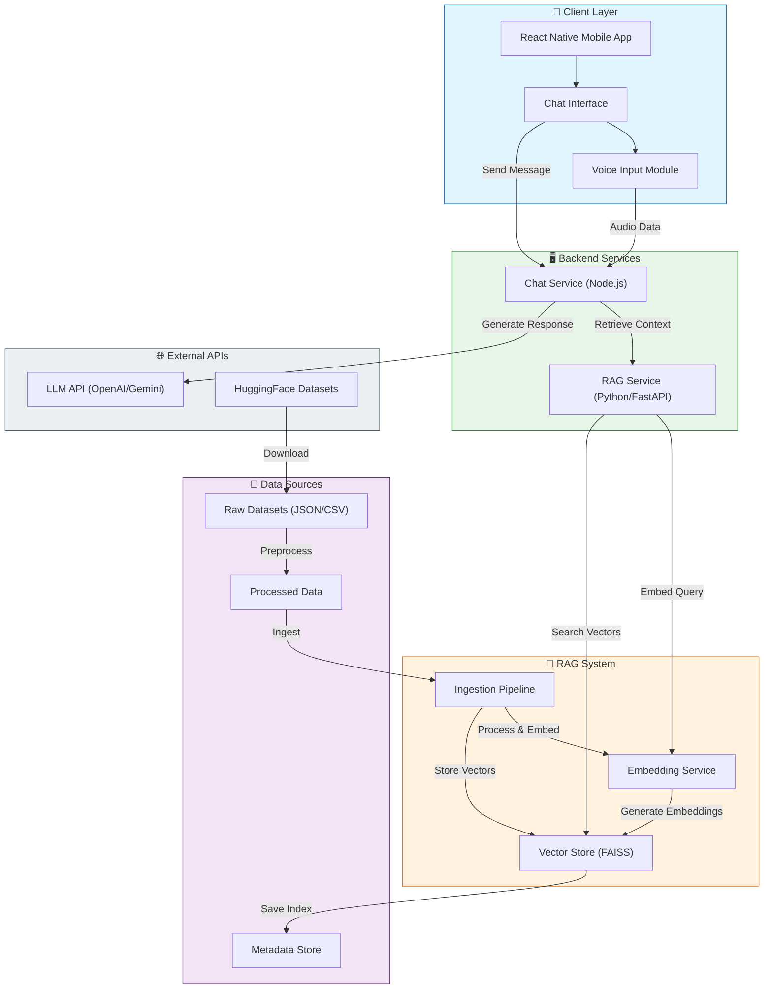

# System Architecture

## 🏗️ High-Level Architecture

The PediTrack system consists of a mobile application frontend, a Node.js chat service, and a Python-based RAG (Retrieval-Augmented Generation) microservice.

## 🔄 Data Flow

1.  **User Interaction**: User sends a message (text or voice) via the Mobile App.
2.  **Chat Service**: Receives the message.
3.  **Context Retrieval**: Chat Service queries the RAG Service for relevant medical information.
4.  **RAG Processing**:
    *   RAG Service embeds the query using the Embedding Service.
    *   Searches the Vector Store (FAISS) for similar documents.
    *   Returns top-k relevant documents.
5.  **Response Generation**: Chat Service sends the user query + retrieved context to the LLM.
6.  **Final Response**: LLM generates an answer, which is sent back to the Mobile App.

## 🧩 Components

### 1. Mobile App (React Native)
*   **Chat Interface**: User-friendly chat UI.
*   **Voice Input**: Captures audio for voice queries.

### 2. Chat Service (Node.js)
*   **Orchestrator**: Manages communication between client, RAG, and LLM.
*   **API**: Exposes endpoints for the mobile app.

### 3. RAG Service (Python/FastAPI)
*   **API**: `POST /api/rag/retrieve` for context retrieval.
*   **Embedding Service**: Uses `sentence-transformers/all-MiniLM-L6-v2`.
*   **Vector Store**: FAISS index for fast similarity search.
*   **Ingestion Pipeline**: Scripts to process and ingest datasets.

### 4. Data Pipeline
*   **Sources**: HealthCareMagic, PediatricQA, Symptom Checker, etc.
*   **Processing**: Cleaning, filtering for pediatric content, formatting.
*   **Storage**: Local file system for raw/processed data, FAISS index for vectors.
